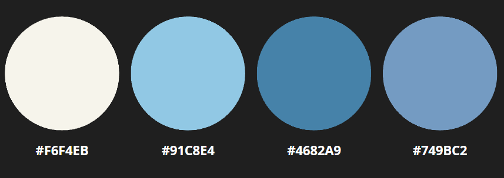

# 📘 MyPortfolio 📖

    Il ne sera jamais parfait... mais il faut bien se lancer !

## Table des matières

- [Informations générales](#📢-informations-générales)

  - [Thème et vision de ce projet](#thème-et-vision-de-ce-projet)
  - [Contexte de réalisation](#contexte-de-réalisation)

- [Technologies](#💻-les-technologies)

  - [Langages](#langages)
  - [Outils](#outils)

- [Ressources](#📁-ressources)

  - [Charte graphique](#charte-graphique)
  - [Bases de données](#bases-de-données)

- [Accès](#🔗-site)

# 📢 Informations générales

## Thème et vision de ce projet

Quoi de mieux pour afiner son apprentissage et reprendre les langages de programmation que de concevoir son propre portfolio ? 🤔📖

Réalisé entièrement par mes soins, ce portfolio met en lumière mes acquis récents en développement. Ce projet représente une occasion idéale pour appliquer mes compétences techniques tout en servant de vitrine pour mes autres passions, telles que la musique 𝄞 et les arts graphiques ✎. 

Chaque réalisation présentée ici reflète mes progrès continus et ma soif d'apprendre.

J'espère que vous trouverez ce portfolio à la fois intéressant et représentatif de mon engagement envers l'apprentissage et l'innovation 🤗 !
 

## Contexte de réalisation

Après avoir découvert les langages de programmation dans le cadre du Bachelor IT proposé par l'école La Plateforme\_, j'ai souhaité mettre en pratique ces compétences à travers un nouveau projet concret et personnel. Ce portfolio m'a offert l'opportunité de consolider les connaissances acquises, de retravailler les éléments dans lesquels je recontre des difficulté et de créer une plateforme qui reflète mes autres centres d'intérêt.

Ce projet s'inscrit dans une démarche d'apprentissage continu, où chaque étape a contribué à affiner mes compétences techniques et créatives. En utilisant des outils de gestion tels que Trello et GitHub, j'ai pu planifier rigoureusement le développement du projet et gérer le code source. Pour assurer une approche professionnelle, j'ai commencé par concevoir une maquette dans Figma afin de visualiser l'interface utilisateur.

De plus, j'ai veillé à ce que le portfolio soit responsive, offrant ainsi une expérience utilisateur tant sur ordinateur que sur smartphone. Ce souci du détail veut garantir que mon travail soit accessible et bien présenté, quelle que soit le format utilisée.

 

# 💻 Les technologies

## Langages

- PHP

- JavaScript

- CSS

- JSON

 

## Outils

- Trello

- Figma

- GitHub

- Uune feuille, un crayon et un 4 couleurs BIC !

 

# 📁 Ressources

## Charte graphique

Pour définir la charte graphique de ce projet, j'ai utilisé Color Hunt, une ressource en ligne réputée pour ses palettes de couleurs harmonieuses et inspirantes. Cet outil m'a permis de sélectionner une combinaison de couleurs cohérente et attrayante, adaptée à l'identité visuelle que je souhaitais créer. En m'appuyant sur ces palettes, j'ai pu assurer une esthétique moderne et agréable à parcourir, renforçant ainsi l'impact visuel et l'expérience utilisateur du site.

## Bases de données

Pour ce projet, j'ai créé une base de données au format JSON, choisie pour sa simplicité et sa compatibilité avec JavaScript. Le format JSON m'a permis de structurer et de stocker les données de manière flexible, tout en facilitant leur manipulation dans l'application web. Grâce à JavaScript, j'ai pu interagir dynamiquement avec ces données pour charger et afficher les informations en temps réel sans recharger la page. Cette approche m'a offert un contrôle précis sur le contenu affiché.

 

# 🔗 Site

url du site
